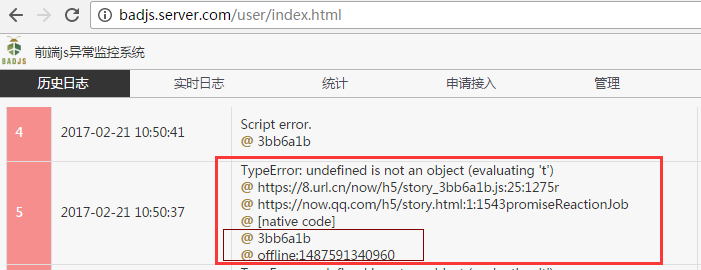
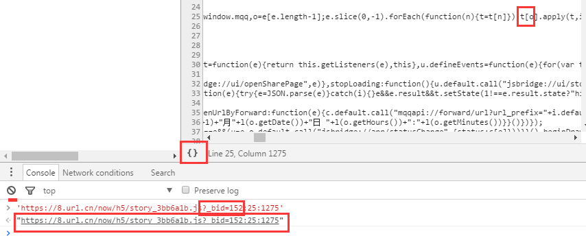
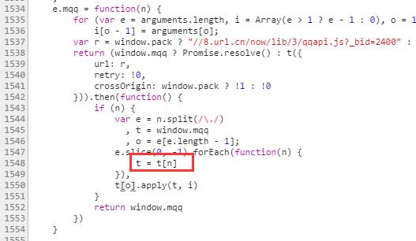

# 脚本错误排查

## 错误栈找源码

进入[badjs监控系统badjs.server.com](http://badjs.server.com)查询到错误栈

使用Chrome打开来源html页面，在控制台输入`'https://8.url.cn/now/h5/story_3bb6a1b.js?_bid=152:25:1275'`回车，点击生成的链接即可定位到代码位置

*注意badjs监控系统中的链接不会有url的参数，控制台定位文件时必须和html请求url完全一致*

点击`{}`可以格式化代码

之后虽然是压缩了的代码肯定也是可以知道错误的地方在哪

## `Script error.`处理

badjs通过window.onerror监听脚本错误, 当错误栈中存在跨域资源时err对象将不会携带错误栈, 信息都为`Script error.`

两个解决办法:
- 对跨域资源设置`Access-Control-Allow-Origin`跨域头
- 包裹异步执行入口

### `Access-Control-Allow-Origin`

可以获取到Android设备的错误栈, 但对离线包/IOS有一些问题:
- 离线包尚不支持返回响应头
- IOS有更严格的要求导致在IOS端几乎无效

### 包裹异步执行入口

现在使用`@tencent/badjs-es5`做异步执行入口的自动包裹(浏览器需要支持`Object.defineProperty`) 

`@tencent/badjs-es5`自动包裹的入口包括:
- `define`, `require`
- `setTimeout`, `setInterval`
- `Promise.prototype.then`, `Promise.prototype.catch`
- 在`XMLHttpRequest.prototype.send`中切入包裹其`onreadystatechange`

*有兴趣的同学可以看一下`@tencent/badjs-es5`的源码*

配合`@tencent/badjs-es5`做的手动切入:
- React的ReactEventListener.dispatchEvent, Transaction.Mixin.perform
- mqq的fireCallback

此步骤在`now-lib-trunk.git`公用资源库中完成, 详情请参考它的README.md

