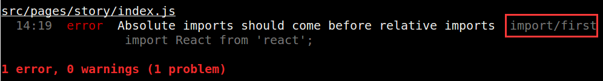

# 代码检查

代码检查使用[Cilint](https://github.com/feix760/cilint)借助[Eslint](http://eslint.org/)对新增行检查

- [团队规范](#团队规范)
- [编辑器配置](#编辑器配置)
- [修改规范](#修改规范)
- [Cilint的使用](#cilint的使用)
- [执行原理](#执行原理)

## 团队规范

- 团队规范继承Eslint Airbnb规范，中文文档: https://github.com/iv-web/javascript
- 继承Eslint Airbnb后的自定义规则如下:

```json
{
    "indent": ["error", 4, {
        "SwitchCase": 1
    }],
    "react/jsx-indent": ["error", 4],
    "react/jsx-indent-props": ["error", 4],
    "comma-dangle": "warn",
    "no-param-reassign": "warn",
    "no-underscore-dangle": "off",
    "no-bitwise": "off",
    "class-methods-use-this": "warn",
    "no-unused-expressions": "warn",
    "keyword-spacing": "warn",
    "consistent-return": "off",
    "one-var": ["warn", "always"],
    "arrow-body-style": ["warn", "as-needed"],
    "space-before-function-paren": ["error", "never"],
    "no-trailing-spaces": ["error", { "skipBlankLines": true }],
    "import/no-absolute-path": "off",
    "import/extensions": "off",
    "import/no-unresolved": "off",
    "import/no-named-as-default-member": "off",
    "import/no-named-as-default": "off",
    "import/no-extraneous-dependencies": "warn",
    "react/prop-types": "off",
    "react/jsx-filename-extension": "off"
}
```

详细请参阅`.eslintrc.js`配置文件: https://github.com/iv-web/fis.free/blob/master/conf/.eslintrc.js

## 编辑器配置

- 项目根目录下包含[.editorconfig](conf/.editorconfig)文件
- @TODO 针对sublime/webstorm等主流编辑器的详细配置说明

## 修改规范

- `.eslintrc.js`, `.cilintrc.js`托管在此项目的[conf](https://github.com/iv-web/fis.free/tree/master/conf)目录下
- `npm start`运行构建时会自动更新配置, 如需更改规则请修改[conf](https://github.com/iv-web/fis.free/tree/master/conf)下的文件，且会对所有项目生效

## Cilint的使用

- 跳过Cilint的检查, 使用`--no-verify`选项跳过检查
```sh
git commit -m 'skip cilint commit' --no-verify
```
- 错误信息查阅及修正指引: 



每一个错误都有一个错误类型，上图的类型为`import/first`, 由插件`eslint-plugin-import`提示，转至其规则列表页https://github.com/benmosher/eslint-plugin-import#rules 搜索`first`即可查阅到详细信息

规则列表:
    - eslint: http://eslint.org/docs/rules/
    - eslint-plugin-react: https://github.com/yannickcr/eslint-plugin-react#list-of-supported-rules
    - eslint-plugin-import: https://github.com/benmosher/eslint-plugin-import#rules
    - eslint-plugin-jsx-a11y: https://github.com/evcohen/eslint-plugin-jsx-a11y#supported-rules

- Bug跟踪修复, 请向 https://github.com/feix760/cilint 提issue或者直接联系fishineyuan

## 执行原理

- `npm start`运行构建时[fis3-hook-ivweb](https://github.com/iv-web/fis3-hook-ivweb)调用Cilint的initializer
- Cilint的initializer初始化`.cilintrc.js`, `.eslintrc.js`, `hooks/precommit`
- Git commit时`hooks/precommit`调用Cilint
- Cilint调用Eslint，Git计算新增行的检查信息

